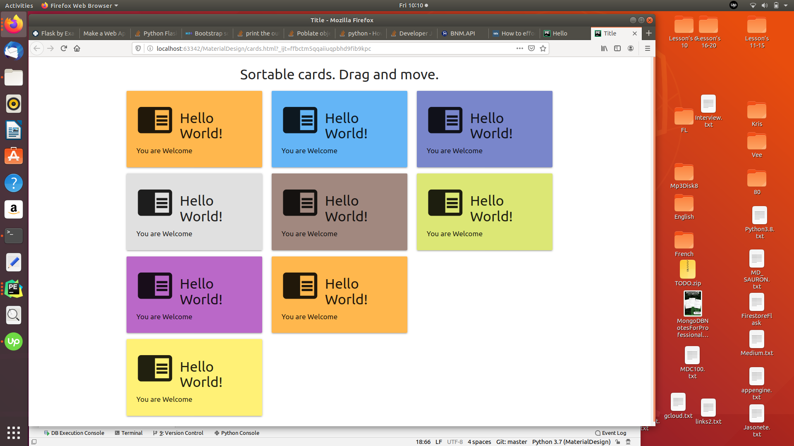

#Materialize UI:
## Create resposive HTML pages with Materialize

- *main.html* - Landing page
- *base htm*l  - starter page
- *sortable.html* - sortable list <li>  of elements jQuery
- *data_picker html* - date_picker - select the Date
- *cards,html* - Use cards create visial pages

